```{=html}
<section class="mp-pagehead">
  <div class="mp-wrap">
    <h1>Projects</h1>
    <p>Selected work from my Master's program, each built around turning a large dataset into something a decision-maker can use.</p>
  </div>
</section>

<section class="mp-section">
  <div class="mp-wrap">
    <h2>Featured</h2>

    <article class="mp-project" id="salary-analysis">
      <a class="mp-thumb" href="assets/img/m03-bubble-occupations.webp" aria-label="Open the occupation salary chart at full size">
        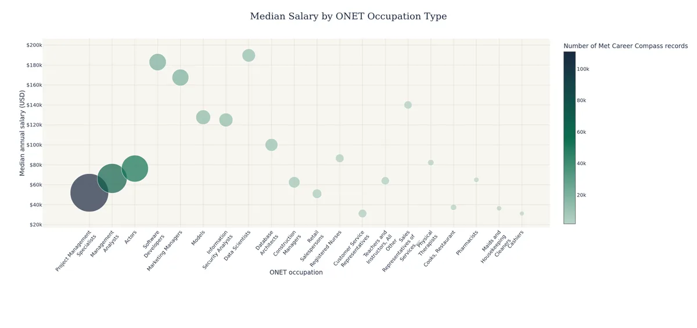
      </a>
      <div class="mp-body">
        <p class="mp-kicker">Course project · AD688 Module 3 · Fall 2026</p>
        <h3>Job-Market Salary Analysis at Scale</h3>
        <p>I used PySpark on AWS to clean and analyze about 504,000 job postings, then built interactive Plotly charts of salary by industry, occupation, education level, and remote-work type.</p>
        <p>Postings without a stated salary were left out instead of being filled with an average, and each chart's write-up notes the data's quirks, such as hourly wages and default experience values. One finding: median posted pay for remote roles ($128,000) ran well above onsite roles ($77,500). The dataset was provided by the course.</p>
        <ul class="mp-tags" aria-label="Technologies">
          <li>PySpark</li><li>AWS EC2</li><li>Plotly</li><li>Quarto</li>
        </ul>
      </div>
    </article>

    <article class="mp-project" id="career-evaluation-product">
      <a class="mp-thumb" href="https://mpp66-ctrl.github.io/ad688-industry-career-product-group6/" aria-label="Open the Group 6 project site">
        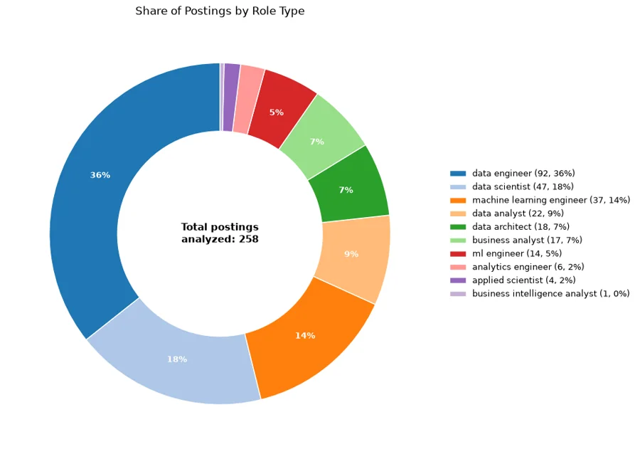
      </a>
      <div class="mp-body">
        <p class="mp-kicker">Team project · AD688 · Fall 2026</p>
        <h3>Career Evaluation Product, Group 6</h3>
        <p>A team-built career-evaluation product for job seekers targeting Data Analyst roles, with growth paths toward Data Scientist and Analytics Engineer, scoped to the Data Processing, Hosting, and Related Services industry (NAICS 5182).</p>
        <p>The project site walks through data preparation, exploratory analysis, and a skill-gap analysis that asks which skills and tools best separate analyst roles from data-science and ML-oriented roles.</p>
        <ul class="mp-tags" aria-label="Technologies">
          <li>Quarto</li><li>GitHub Pages</li><li>Labor-market analytics</li><li>Team project</li>
        </ul>
        <p class="mp-links">
          <a class="btn btn-sm btn-primary" href="https://mpp66-ctrl.github.io/ad688-industry-career-product-group6/"><i class="bi bi-box-arrow-up-right" aria-hidden="true"></i> Live site</a>
          <a class="btn btn-sm btn-outline-primary" href="https://github.com/mpp66-ctrl/ad688-industry-career-product-group6"><i class="bi bi-github" aria-hidden="true"></i> Source</a>
        </p>
      </div>
    </article>
  </div>
</section>

<section class="mp-section" style="padding-top:0">
  <div class="mp-wrap">
    <h2>More charts from the salary analysis</h2>
    <p class="mp-section-intro">The full analysis has 12 charts. The occupation chart is featured above, and the rest are grouped below. Select any chart to open it at full size. Medians use only postings that list a salary, and the scatter plots show a random sample of 100 postings per group.</p>

    <h3 class="mp-subhead">Pay by industry</h3>
    <div class="mp-figs">
      <figure class="mp-fig mp-fig-wide">
        <a href="assets/img/m03-box-industry.webp" aria-label="Open this chart at full size">
          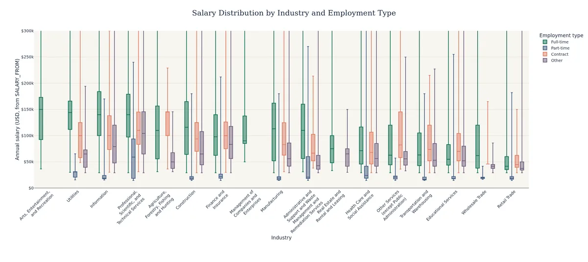
        </a>
        <figcaption><strong>Salary by industry and employment type:</strong> full-time median pay is highest in Arts, Entertainment, and Recreation ($150,000, based on only 43 postings) and lowest in Retail Trade ($41,600). Part-time figures annualize hourly wages at an assumed 20 hours a week.</figcaption>
      </figure>
    </div>

    <h3 class="mp-subhead">Pay by education level</h3>
    <div class="mp-figs">
      <figure class="mp-fig">
        <a href="assets/img/m03-scatter-associates.webp" aria-label="Open this chart at full size">
          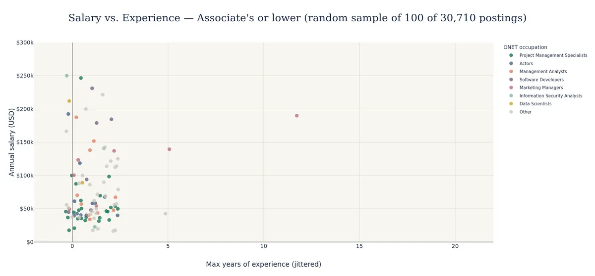
        </a>
        <figcaption><strong>Associate's or lower:</strong> 30,710 postings with a usable salary, median $55,349. 95% show exactly one year of maximum experience, which looks like a platform default.</figcaption>
      </figure>
      <figure class="mp-fig">
        <a href="assets/img/m03-scatter-bachelors.webp" aria-label="Open this chart at full size">
          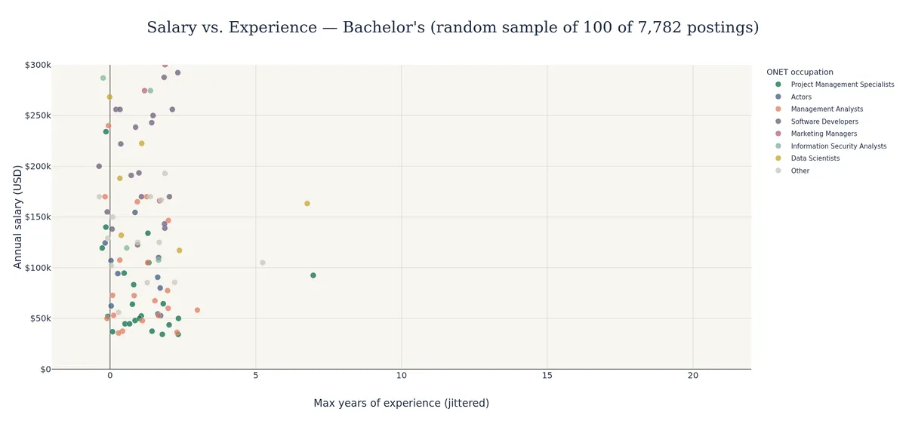
        </a>
        <figcaption><strong>Bachelor's:</strong> 7,782 postings with a usable salary, median $130,500. 91% show exactly one year of maximum experience, which looks like a platform default.</figcaption>
      </figure>
      <figure class="mp-fig">
        <a href="assets/img/m03-scatter-masters.webp" aria-label="Open this chart at full size">
          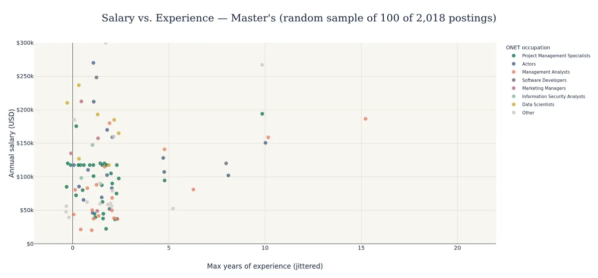
        </a>
        <figcaption><strong>Master's:</strong> 2,018 postings with a usable salary, median $104,000. 83% show exactly one year of maximum experience, which looks like a platform default.</figcaption>
      </figure>
      <figure class="mp-fig">
        <a href="assets/img/m03-scatter-phd.webp" aria-label="Open this chart at full size">
          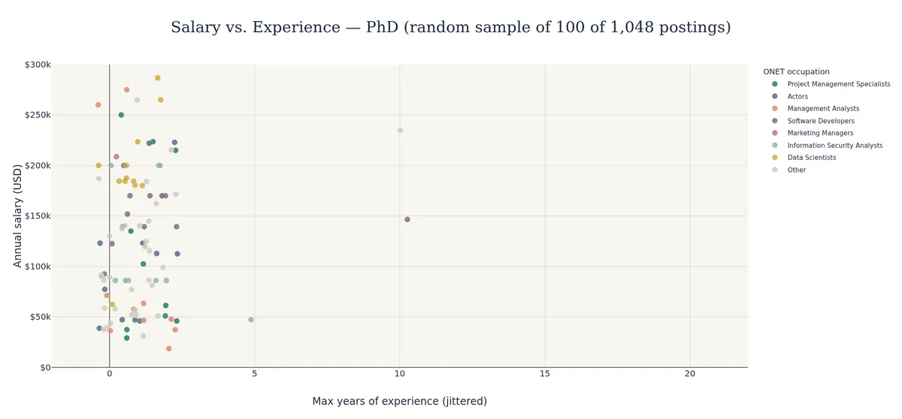
        </a>
        <figcaption><strong>PhD:</strong> 1,048 postings with a usable salary, median $123,048. 95% show exactly one year of maximum experience, which looks like a platform default.</figcaption>
      </figure>
    </div>

    <h3 class="mp-subhead">Pay by work type</h3>
    <div class="mp-figs">
      <figure class="mp-fig">
        <a href="assets/img/m03-scatter-remote.webp" aria-label="Open this chart at full size">
          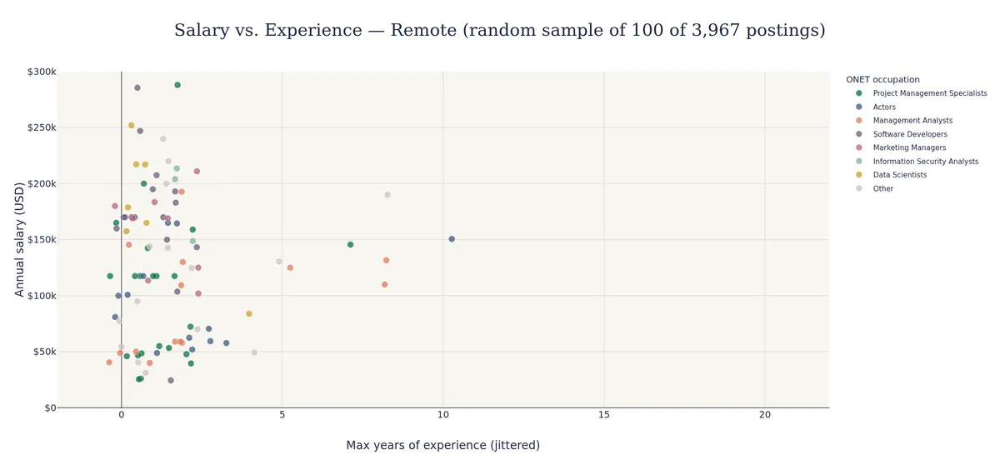
        </a>
        <figcaption><strong>Remote:</strong> 3,967 postings with a usable salary, median $118,080. 87% show exactly one year of maximum experience, which looks like a platform default.</figcaption>
      </figure>
      <figure class="mp-fig">
        <a href="assets/img/m03-scatter-hybrid.webp" aria-label="Open this chart at full size">
          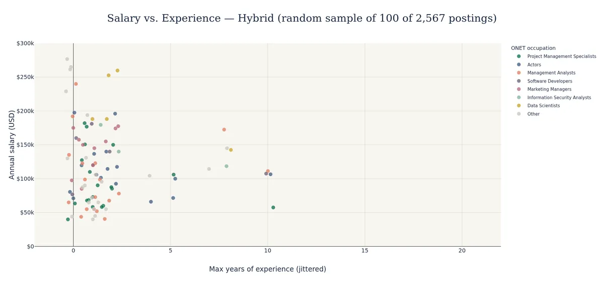
        </a>
        <figcaption><strong>Hybrid:</strong> 2,567 postings with a usable salary, median $115,000. 78% show exactly one year of maximum experience, which looks like a platform default.</figcaption>
      </figure>
      <figure class="mp-fig">
        <a href="assets/img/m03-scatter-onsite.webp" aria-label="Open this chart at full size">
          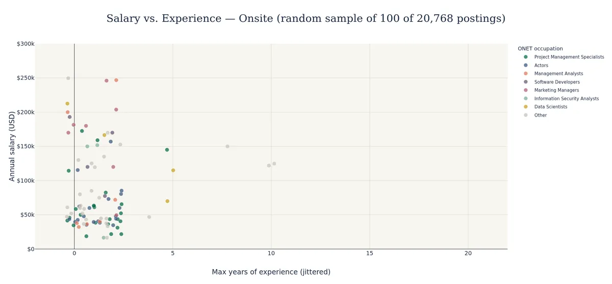
        </a>
        <figcaption><strong>Onsite:</strong> 20,768 postings with a usable salary, median $57,300. 95% show exactly one year of maximum experience, which looks like a platform default.</figcaption>
      </figure>
    </div>

    <h3 class="mp-subhead">Salary distributions: remote, hybrid and onsite</h3>
    <div class="mp-figs">
      <figure class="mp-fig">
        <a href="assets/img/m03-hist-remote.webp" aria-label="Open this chart at full size">
          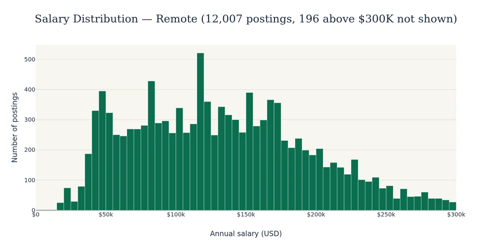
        </a>
        <figcaption><strong>Remote:</strong> 12,007 postings with a usable salary, median $128,000. Only 9.3% pay under $50,000.</figcaption>
      </figure>
      <figure class="mp-fig">
        <a href="assets/img/m03-hist-hybrid.webp" aria-label="Open this chart at full size">
          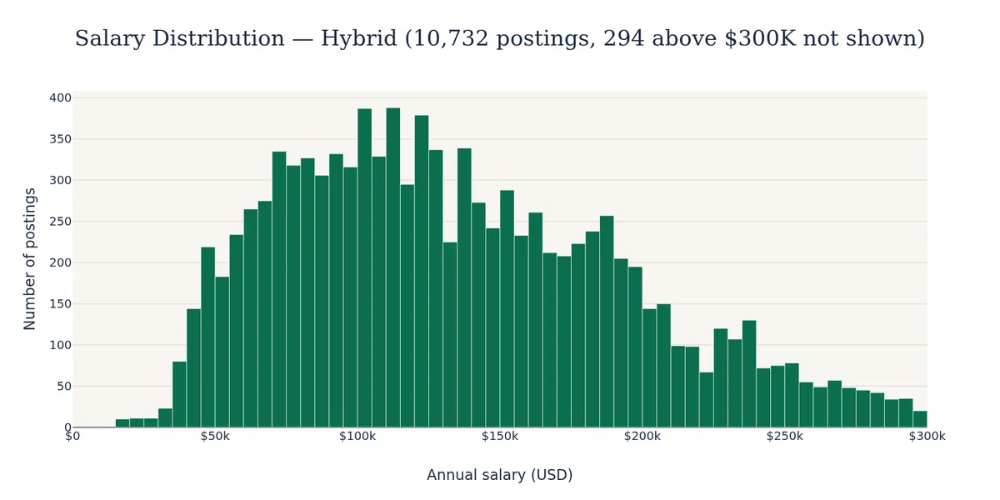
        </a>
        <figcaption><strong>Hybrid:</strong> 10,732 postings with a usable salary, median $127,300. Only 4.6% pay under $50,000, the lowest share of the three groups.</figcaption>
      </figure>
      <figure class="mp-fig">
        <a href="assets/img/m03-hist-onsite.webp" aria-label="Open this chart at full size">
          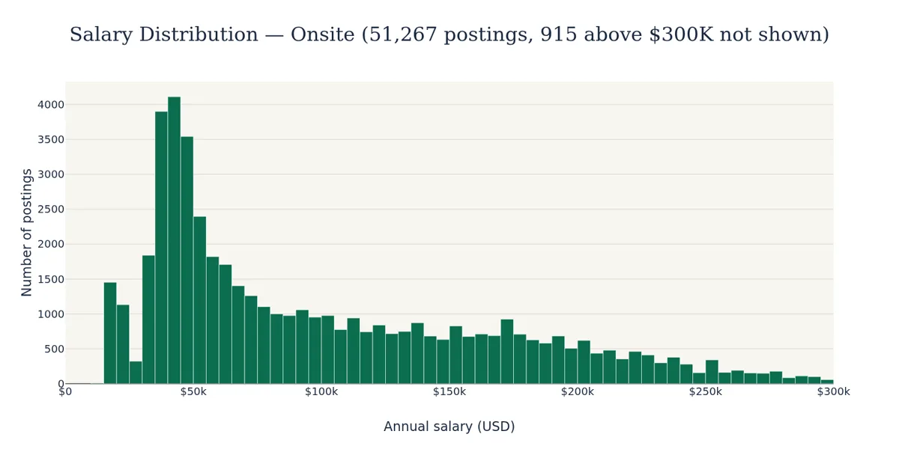
        </a>
        <figcaption><strong>Onsite:</strong> 51,267 postings with a usable salary, median $77,500. Nearly a third (31.8%) pay under $50,000.</figcaption>
      </figure>
    </div>
  </div>
</section>

<section class="mp-section" style="padding-top:0">
  <div class="mp-wrap">
    <h2>More coursework and builds</h2>
    <div class="mp-mini-grid">

      <div class="mp-mini">
        <p class="mp-kicker">Module 2 · Fall 2026</p>
        <h3>Spark SQL and DataFrames analysis</h3>
        <p>Spark SQL queries over a multi-table job-postings schema: salary by industry and metro area, top remote-hiring companies in California, and monthly posting trends. Null-safe joins kept rows from being silently dropped.</p>
        <ul class="mp-tags" aria-label="Technologies"><li>Spark SQL</li><li>PySpark</li><li>Plotly</li><li>Seaborn</li></ul>
      </div>

      <div class="mp-mini">
        <p class="mp-kicker">Module 1 · Fall 2026</p>
        <h3>Cloud foundations on AWS</h3>
        <p>Set up a cloud development environment on AWS EC2 with Spark, VS Code Remote-SSH, and Git, then used it to build and publish the first version of this site.</p>
        <ul class="mp-tags" aria-label="Technologies"><li>AWS EC2</li><li>Spark</li><li>Git</li></ul>
      </div>

      <div class="mp-mini">
        <p class="mp-kicker">Personal project</p>
        <h3>This portfolio site</h3>
        <p>Built with Quarto and deployed to GitHub Pages through GitHub Actions. Designed to load quickly, with optimized images, system fonts, no tracking scripts, a light and dark mode toggle, and accessible markup.</p>
        <ul class="mp-tags" aria-label="Technologies"><li>Quarto</li><li>GitHub Actions</li><li>CSS</li></ul>
        <p class="mp-links"><a class="btn btn-sm btn-outline-primary" href="https://github.com/mpp66-ctrl/mpp66-ctrl.github.io"><i class="bi bi-github" aria-hidden="true"></i> Source</a></p>
      </div>

    </div>
  </div>
</section>
```
